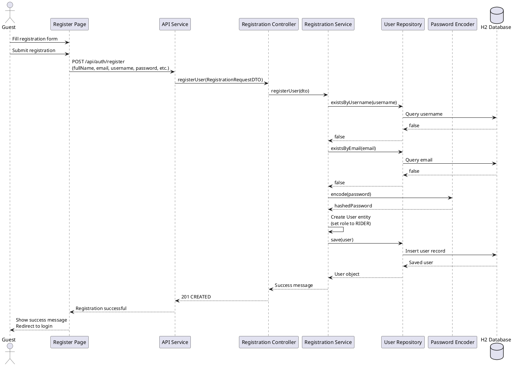
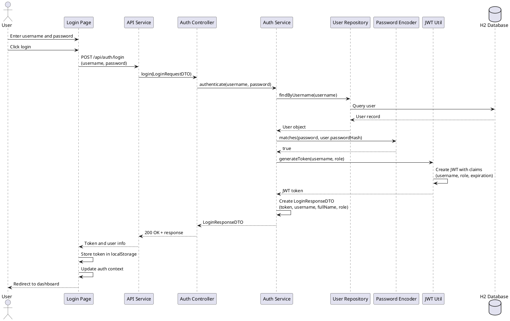
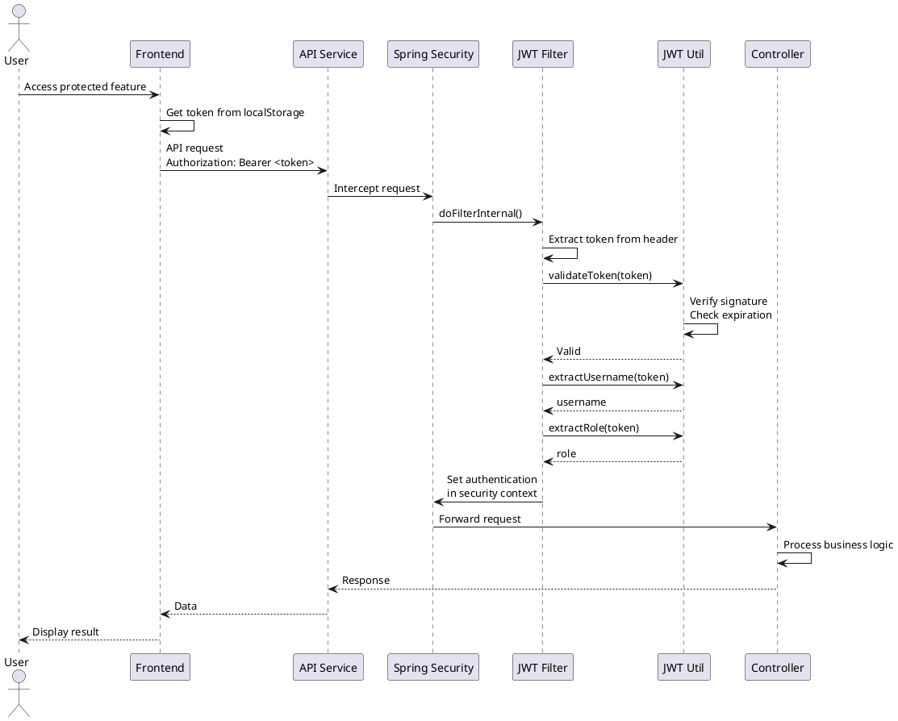
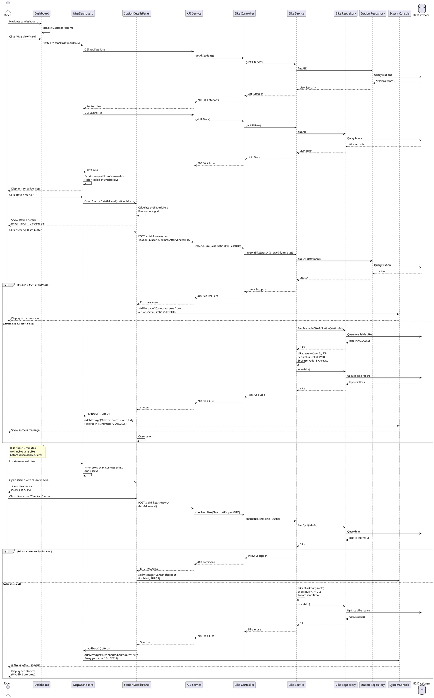

# QwikRide Sequence Diagrams

## Overview
These diagrams show the flow of operations for key user interactions in the system.

---

## 1. User Registration Flow

Shows how a new user registers for an account.

### Flow Description

1. **Guest fills form**: User enters their details on the registration page
2. **Validation**: System checks if username and email are unique
3. **Password hashing**: Password is encrypted using BCrypt before storage
4. **User creation**: New user is saved with RIDER role by default
5. **Success**: User is redirected to login page

### Error Scenarios

- If username exists → Return 400 with "Username already taken"
- If email exists → Return 400 with "Email already registered"
- If validation fails → Return 400 with validation errors

---

## 2. User Login Flow

Shows how a user authenticates and gets a JWT token.

### Flow Description

1. **User enters credentials**: Username and password submitted
2. **User lookup**: System finds user by username
3. **Password verification**: BCrypt compares hashed passwords
4. **Token generation**: JWT token created with user info and role
5. **Response**: Token sent to frontend and stored in localStorage
6. **Redirect**: User sent to role-based dashboard

### Error Scenarios

- If username not found → Return 401 "Invalid credentials"
- If password incorrect → Return 401 "Invalid credentials"
- If validation fails → Return 400 with validation errors

---

## 3. Authenticated Request Flow

Shows how protected endpoints verify user identity.

### Flow Description

1. **Token included**: Frontend adds JWT to Authorization header
2. **Token validation**: Spring Security filter validates token
3. **Extract claims**: Username and role extracted from token
4. **Set context**: User authentication set in security context
5. **Process request**: Controller handles the business logic
6. **Return response**: Data sent back to frontend

### Error Scenarios

- If token missing → Return 401 "Unauthorized"
- If token expired → Return 401 "Token expired"
- If token invalid → Return 401 "Invalid token"
- If user lacks permission → Return 403 "Forbidden"

---

## 4. Rider Reserves and Checks Out Bike Flow

Shows how a rider reserves a bike through the Dashboard UI and proceeds to checkout.

### Flow Description

1. **Navigate to Dashboard**: Rider accesses the dashboard and sees the home view with cards
2. **Switch to Map View**: Rider clicks "Map View" card to see interactive map
3. **Load Map Data**: System fetches all stations and bikes, renders map with color-coded markers
4. **Select Station**: Rider clicks a station marker to view details
5. **View Station Details**: Panel shows dock grid, available bikes, and capacity
6. **Reserve Bike**: Rider clicks "Reserve Bike" button
   - System validates station is in service
   - Finds an available bike at the station
   - Changes bike status to RESERVED
   - Sets 15-minute expiration timer
7. **Confirmation**: Success message appears in system console
8. **Checkout Bike**: Within 15 minutes, rider returns to reserved bike
   - System validates rider owns the reservation
   - Changes bike status to IN_USE
   - Records trip start time
9. **Trip Started**: Rider can now ride the bike

### Business Rules

- **DM-05**: Reservation disabled if bikesAvailable == 0 or station OUT_OF_SERVICE
- **Reservation expires**: After 15 minutes, bike becomes AVAILABLE again
- **Single reservation**: Rider can only have one active reservation at a time
- **Checkout validation**: Only the rider who reserved can checkout that specific bike

### Error Scenarios

- If station is OUT_OF_SERVICE → Return 400 "Cannot reserve from out-of-service station"
- If no bikes available → Return 400 "No bikes available at this station"
- If rider already has reservation → Return 400 "Already have an active reservation"
- If checkout wrong bike → Return 403 "Cannot checkout this bike"
- If reservation expired → Return 400 "Reservation has expired"

### Console Messages

**Success Messages (Green):**
- "System loaded successfully"
- "Bike reserved successfully (expires in 15 minutes)"
- "Bike checked out successfully. Enjoy your ride!"

**Error Messages (Red):**
- "Cannot reserve bike from out-of-service station"
- "No bikes available at this station"
- "Cannot checkout this bike"
- "Reservation has expired"

---

## Key Components

### Frontend
- **Pages**: React components for UI
- **API Service**: Axios instance for HTTP requests
- **Auth Context**: Global authentication state

### Backend
- **Controllers**: Handle HTTP requests and responses
- **Services**: Business logic layer
- **Repositories**: Database access layer
- **Security**: JWT filter and configuration
- **DTOs**: Data transfer objects for API communication

### Security
- **BCrypt**: Password hashing (one-way encryption)
- **JWT**: Stateless authentication tokens
- **Spring Security**: Framework for authentication and authorization

