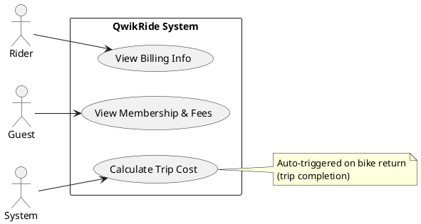

````markdown
# Pricing & Billing Use Case Diagram (Simplified)

Combined view of the pricing/billing use cases:

- UC-PRC-01: Calculate Trip Cost
- UC-PRC-02: View Billing Info
- UC-PRC-03: View Membership & Fees

## Diagram



Minimal notes:

- UC-PRC-01 is automatic when the rider returns a bike (trip completion event handled by pricing).
````
