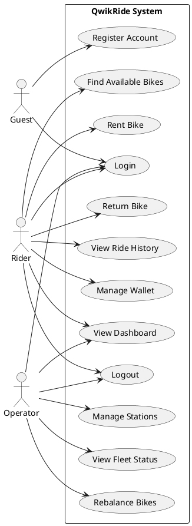

# QwikRide Use Case Diagram

## Overview
This diagram shows all the use cases for the QwikRide bike sharing system and the actors involved.

## Diagram

## Actors

### Guest
Someone who hasn't registered or logged in yet. They can:
- Register for an account
- Login to the system

### Rider
A registered user who rents bikes. They can:
- Login and logout
- View their dashboard
- Find available bikes nearby
- Rent bikes
- Return bikes
- View their ride history
- Manage their wallet/payment info

### Operator
System admin who manages the bike sharing network. They can:
- Login and logout
- View their dashboard
- Manage bike stations
- Check fleet status
- Rebalance bikes across stations

## Use Cases

### Implemented
- **UC1: Register Account** - Create a new rider account
- **UC2: Login** - Authenticate with username and password
- **UC3: Logout** - End user session
- **UC4: View Dashboard** - See personalized dashboard based on role

### Planned
- **UC5: Find Available Bikes** - Search for bikes near a location
- **UC6: Rent Bike** - Start a bike rental
- **UC7: Return Bike** - End rental and return bike to station
- **UC8: View Ride History** - See past rides and costs
- **UC9: Manage Wallet** - Add funds and view balance
- **UC10: Manage Stations** - Add/edit bike stations
- **UC11: View Fleet Status** - Monitor all bikes and their status
- **UC12: Rebalance Bikes** - Move bikes between stations

